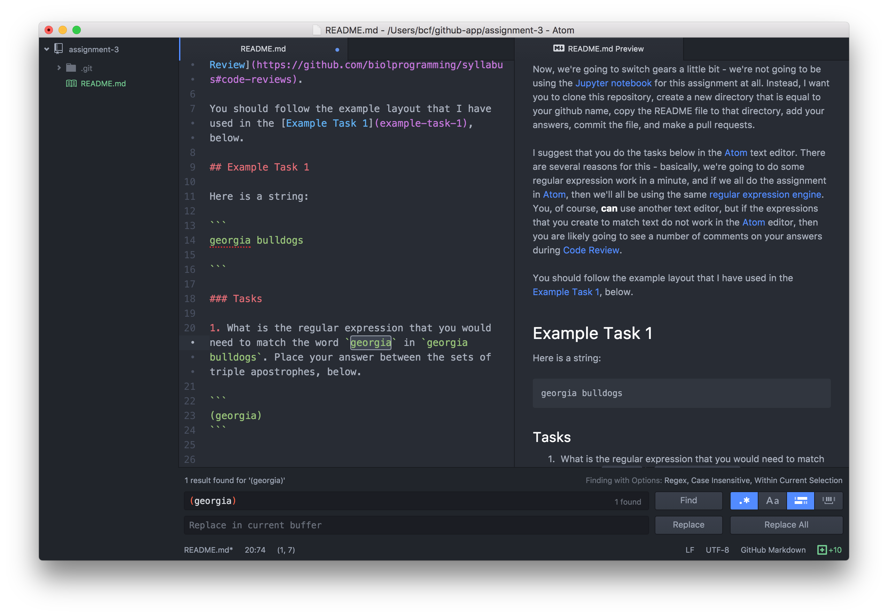

# Assignment 3

Now, we're going to switch gears a little bit - we're not going to be using the [Jupyter notebook](http://jupyter.org/) for this assignment at all.  Instead, I want you to clone this repository, create a new directory that is equal to your github name in the `answers` directory, copy the README file to that directory, add your answers, commit the file, and make a pull request.

I suggest that you do the tasks below in the [Atom](https://atom.io/) text editor. There are several reasons for this - basically, we're going to do some regular expression work in a minute, and if we all do the assignment in [Atom](https://atom.io/), then we'll all be using the same [regular expression engine](https://en.wikipedia.org/wiki/Comparison_of_regular_expression_engines).  You, of course, **can** use another text editor, but if the expressions that you create to match the text do not work in the [Atom](https://atom.io/) editor, then you are likely going to see a number of comments on your answers during [Code Review](https://github.com/biolprogramming/syllabus#code-reviews).

You should follow the example layout that I have used in the [Example Task 1](example-task-1), below.

Also, here's a hint - you can work only in this file, if you want to. To match **only the selected text** using regular expressions in [Atom](https://atom.io/):

1. Highlight the text
2. Open the "find" command (⌘-f on Mac, ctrl-f on windows)
3. Turn on regular expression matching **and** "Only in selection" matching like so:



Once you click them, the blue in the boxes (lower right corner) indicates that each of these are turned on.

4. Enter the correct regular expression in the top box (what you are finding - the bottom box is what you would like to replace it with... if you are replacing text).
5. If all is working correctly and your regular expression is correct, then you will see that you have "matched" what you are searching for (i.e., only the `georgia` in `georgia bulldogs`).

**Alternatively**, you may want to copy the text you are searching/replacing to a new window, and work on each find/replace expression until you get it correct. Once it's correct, paste the correct expression(s) back in this document in the appropriate set of brackets.

If you are interested in how the [regular expression engine](https://en.wikipedia.org/wiki/Comparison_of_regular_expression_engines) is matching your expression (and what you might be missing), you can see the engine at work by using [this nifty gizmo from regex101.com](https://regex101.com/r/rF8pM2/12#javascript).  It also allows you to see how different engines (PCRE, Python) would work using the same expression (you can select the "Flavor" on the far left side).  [Atom](https://atom.io/) uses the `javascript` engine.

## Example Task 1

Here is a string:

```
lsu tigers
```

### Tasks

1. What is the regular expression that you would need to match the word `tigers` in `lsu tigers`. Place your answer between the sets of triple apostrophes, below (I have put my answer in the triple-quotes already).

  **FIND**:
  ```
  (tigers)
  ```

## Task Set 1

Ok, let's do this.  Here is a string of characters representing a DNA sequence containing [microsatellite repeats](https://en.wikipedia.org/wiki/Microsatellite):

```
ACGRRGCGAGCGAGSGAGCGCTATATATATATGCRGCTSGCTGTG
```

### Tasks

1. What regular expression matches only the entire dinucleotide repeat (AT)5?  Enter your answer in the triple quotes directly below:

  **FIND**:
  ```

  ```

2. What is one alternative way to find this same sequence? Enter your answer in the triple quotes directly below:

  **FIND**:
  ```

  ```

3. What is one more alternative way to find this same sequence? Enter your answer in the triple quotes below:

  **FIND**:
  ```

  ```

4. How would you find all instances of `R` **or** `S` (degenerate base codes) in the same DNA sequence, above? Enter your answer in the triple quotes below:

  **FIND**:
  ```

  ```

4. How would you find all instances of `R` **or** `S` (degenerate base codes) in the same DNA sequence, above, and **replace** them with the ambiguous base code `N`.  Place the search string in the `FIND` section below, and the replacement string in the `REPLACE` section below:

  **FIND**:
  ```

  ```

  **REPLACE**:
  ```

  ```

## Task Group 2

Ok, now let's do something a little different (and harder).  We're going to be pretending like we're editing a spreadsheet that someone sent us in CSV format (bastards!), and we don't have Excel to use as a crutch.  That spreadsheet looks like the following:

```
animal,legs,fingers,toes
human,2,10,10
dog,4,4,4
spider,8,0,0
```

**Note**: I am working under the assumption that dogs do have fingers but spiders do not have fingers or toes.

### Tasks

1. Reverse the order of the columns from 1,2,3,4 (as you see them) to 4,3,2,1.  To do this, you need to both `FIND` some things and `REPLACE` them (AKA "re-arrange" them, but you also do that in the `REPLACE` box).  Enter the expression for each operation in the correct position, below:

  **FIND**:
  ```

  ```

  **REPLACE**:
  ```

  ```

2. You realize that only the last two columns of data are in the wrong order (3,4).  You want to reverse the order of only the last two columns (4,3).  How do you do that?

  **FIND**:
  ```

  ```

  **REPLACE**:
  ```

  ```


3. Your boss hates comma-separated value (CSV) files and really loves tab separated value files (no one is sure why, because we all know that CSV is the penultimate format for data of this sort). Replace the commas in the CSV text with tabs.

  **FIND**:
  ```

  ```

  **REPLACE**:
  ```

  ```


4. Your boss still hates comma-separated value (CSV) files.  For whatever reason (bosses often ask for odd things), they want the first two columns separated by the pipe character "`|`", the 2nd and 3rd columns separated by tabs, and the 3rd and 4th columns separated by colons.  Make that happen.

  **FIND**:
  ```

  ```

  **REPLACE**:
  ```

  ```

## Task Group 3

Here is a typical fastq-formatted header from an Illumina sequencer (this is a real header from a real sequencing run).  There's lots of info in these header strings, and you need to parse some of that information out of the header string (which always starts with `@` for fastq data versus `>` for fasta data):

```
@SN1083:466:HA8VPADXX:1:1101:1997:2233 1:N:0:89
```

### Tasks

1. The read number is the first integer value that you see **following the space** in the header.  How would you parse out **only the read number** from the header above?

  **FIND**:
  ```

  ```

  **REPLACE**:
  ```

  ```

1. The flowcell serial number is the 3rd set of characters that looks like `HA8VPADXX`.  How would you parse out **only the flowcell** from the header above?

  **FIND**:
  ```

  ```

  **REPLACE**:
  ```

  ```

1. Now, assume that the flowcell serial number stays in the same position (the third "column" of information separated by colons) but also assume that the flowcell value can take on different values. How would you parse out **only the flowcell** from the header above?

  **FIND**:
  ```

  ```

  **REPLACE**:
  ```

  ```

## Task Group 4

Here is the same header, but this time with all of the associated sequence and quality data (I have truncated it - it was PE150).  This is a fully-qualified fastq sequence (again, from an actual run - these data are from a bird):

```
@SN1083:466:HA8VPADXX:1:1101:1997:2233 1:N:0:89
AGGGTGAAGGTGGCGCAGAATGAGCTGGGACAGCAGATCCTAGCTGACTTCGAGGAAGCCT
+
<BB<FFFFFF0BFFFIBBFFFFIFFIIIIIIIIFIIIFFFIIIFBBFFIIFIFFFFFFFFF
```

### Tasks

1. This one is pretty hard because you are dealing with multiple lines now. The serial number of the Illumina sequencer is the first set of numbers after the `@` and before the first colon. How would you extract **only the serial number** from the sequence data? Assume that the characters may not stay the same.

  **FIND**:
  ```

  ```

  **REPLACE**:
  ```

  ```

2. This one is also pretty hard... How would you parse the fastq sequence to turn it into a fasta sequence where the resulting fasta sequence is of the form:

  ```
  >serial-number | flowcell | read number
  sequence
  ```

  **FIND**:
  ```

  ```

  **REPLACE**:
  ```

  ```

## Task Group 5

This one is actually really hard for a somewhat strange reason and **does not count**.  But, see if you can do it - I actually tried it for quite some time before getting it correct.  Return to our microsatellite repeat:

```
ACGRRGCGAGCGAGSGAGCGCTATATATATATGCRGCTSGCTGTG
```

## Tasks

1. How do you extract **only** the (AT)5 microsatellite repeat from the sequence above?

  **FIND**:
  ```

  ```

  **REPLACE**:
  ```

  ```

You are finished.  You are probably also happy and/or angry or even, possibly, both.  The regex pain is complete for the time being.  Next time, we'll be doing this in [Python](http://python.org).

Know that regular expressions are pretty hard for everyone. With some practice (and more practice), you start to get used to how the patterns work, generally, and also how they work, particularly, with your programming language or text-editor of choice. One you have a little time to get a bit [Zen](https://www.youtube.com/watch?v=Q6-DmV4dhek) about regular expressions, you may even start to like them.  

Then again, maybe not.
